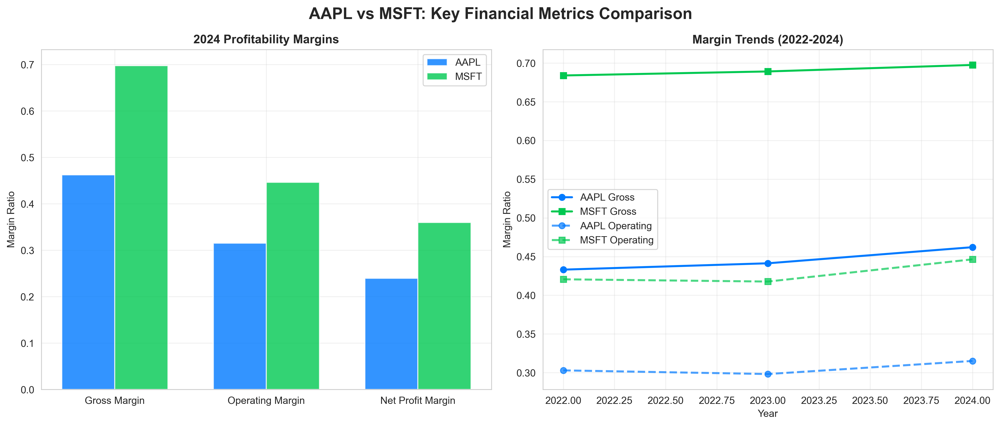
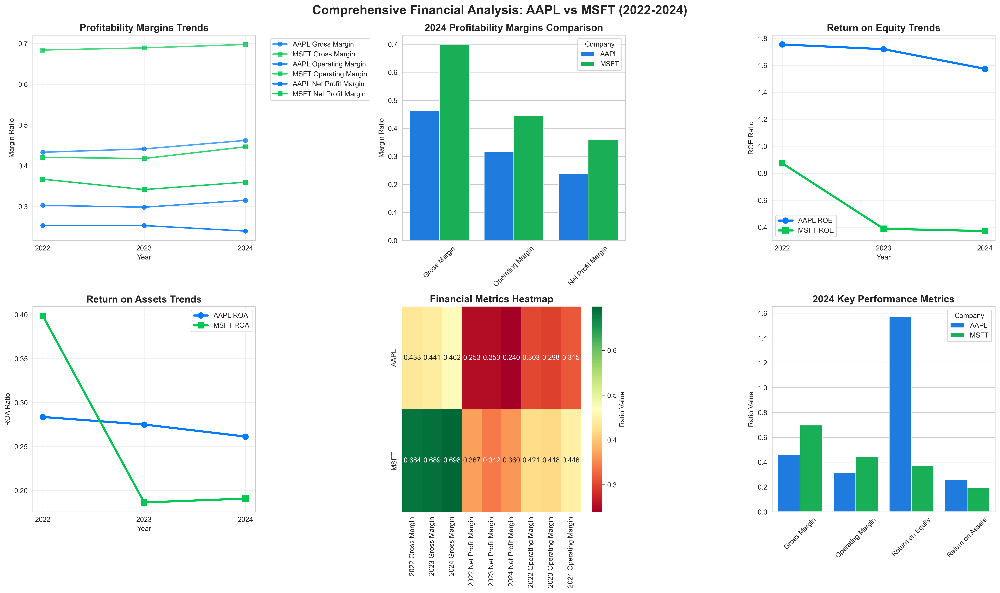
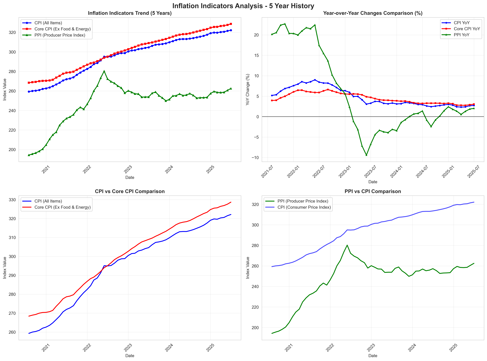
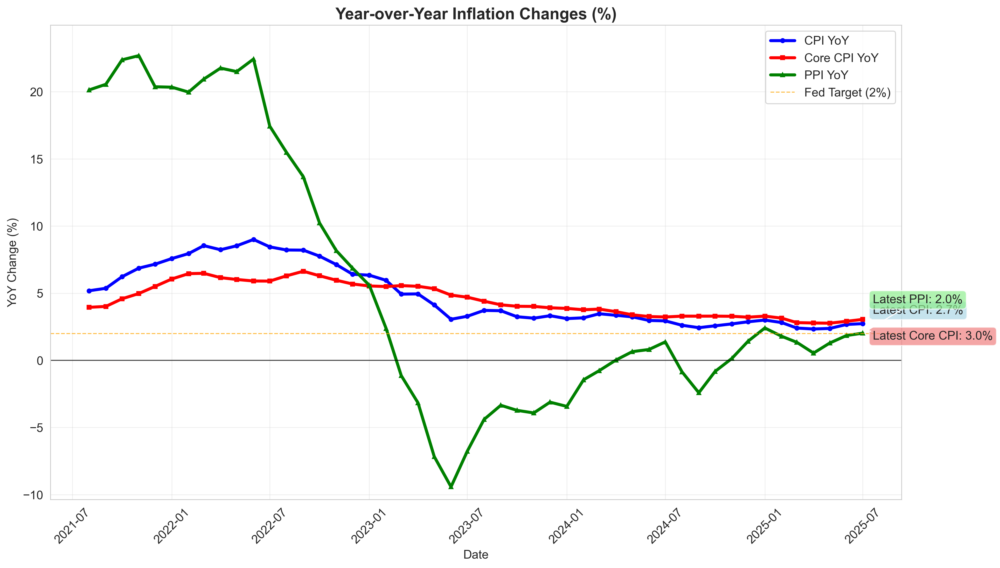

# Financial & Macro Economic Analysis Toolkit
*Last Updated: 2025-08-19*

## 🎯 Project Overview
This repository contains comprehensive financial analysis tools and macro-economic data analysis for informed investment decision-making. The toolkit provides both company-specific financial analysis and broader market context through economic indicators.

## 📊 What's Been Built

### 1. **Company Financial Analysis** 
- **AAPL vs MSFT Comparison**: Comprehensive profitability and efficiency analysis
- **Professional Visualizations**: Multi-panel dashboards with seaborn/matplotlib
- **Streamlined Reporting**: Key metrics in tables, detailed data in charts
- **Automated Analysis**: Python scripts for reproducible financial analysis

### 2. **Economic Data Integration**
- **FRED API Integration**: Federal Reserve Economic Data access
- **CPI Analysis**: Consumer Price Index tracking and inflation metrics
- **Sample Data Generation**: Fallback data for testing and demonstration
- **Economic Visualizations**: Professional charts for economic indicators

### 3. **Data Presentation Strategy**
This toolkit shows only the most critical metrics in tables for quick reference, while comprehensive detailed data is presented through professional visualizations. The charts contain all historical trends, detailed comparisons, and granular financial metrics that would otherwise clutter the tables.

## 📁 Project Structure

```
NewProject/
├── README.md                 # Main project documentation
├── requirements.txt          # Python dependencies
├── .gitignore               # Git ignore rules (includes .env)
├── .env                     # API keys (not in git - create manually)
├── charts/                  # Generated visualizations
│   ├── financial_comparison_charts.png
│   ├── comprehensive_financial_analysis.png
│   ├── inflation_analysis_charts.png
│   └── yoy_inflation_analysis.png
├── data/                    # Raw data and JSON outputs
│   └── company_profiles_20250819_213912.json
├── scripts/                 # Python analysis scripts
│   ├── company_financial_analysis.py
│   ├── inflation_analysis.py
│   ├── inflation_yoy_analysis.py
│   ├── company_profile_collector.py
│   └── create_financial_charts.py
└── docs/                    # Documentation and reports
    ├── macro_data_todo.md   # Economic data roadmap
    ├── company_fundamentals_todo.md  # Company profile & fundamentals roadmap
    ├── company_profiles_report.md   # Comprehensive company analysis report
    └── inflation_analysis_report.md # Inflation indicators analysis report
```

## 📈 Company Financial Analysis

### AAPL vs MSFT: Key Financial Metrics Summary

#### Most Recent Performance (2024)
| Metric | AAPL | MSFT | Winner |
|--------|------|------|---------|
| **Gross Margin** | 46.2% | 69.8% | 🏆 MSFT |
| **Operating Margin** | 31.5% | 44.6% | 🏆 MSFT |
| **Net Profit Margin** | 24.0% | 36.2% | 🏆 MSFT |
| **Return on Equity** | 157.4% | 37.1% | 🏆 AAPL |
| **Return on Assets** | 26.1% | 19.1% | 🏆 AAPL |

#### Key Performance Trends
- **Microsoft**: Consistently higher margins, stable performance
- **Apple**: Superior capital efficiency, improving margins over time
- **Both**: Strong financial health with different competitive advantages

*For detailed historical trends and comprehensive comparisons, see the visual charts below.*

**📈 What the Charts Show**: The comprehensive dashboard contains all the detailed financial metrics (15+ ratios across 5 years) that were previously displayed in overwhelming tables. This includes interest coverage ratios, tax rates, cash flow ratios, and all other granular financial data presented in an easy-to-understand visual format.

## 📊 Visual Analysis

### Company Financial Charts


### Comprehensive Financial Dashboard


## 🌍 What's Going On: US Market Context

### Economic Indicators Dashboard
*Coming Soon: Real-time economic data integration*

## 🚀 Future Development Roadmap

### Company Profile & Fundamentals Expansion
*Next Phase: Comprehensive company analysis beyond AAPL vs MSFT*

We're expanding the toolkit to include:
- **Company Profiles**: Business overview, distribution models, market presence
- **Financial Statements**: Complete income statements, balance sheets, cash flow statements
- **Advanced Metrics**: Valuation ratios (P/E, P/B, P/S), debt metrics, growth analysis
- **Multi-Company Analysis**: Compare any companies across sectors and industries

See [Company Fundamentals TODO](docs/company_fundamentals_todo.md) for detailed roadmap.

#### **Phase 1 Complete: Company Profile Collection** ✅
Our company profile collector successfully gathers comprehensive data for any publicly traded company, including:
- Basic company information (name, symbol, sector, industry)
- Financial metrics (market cap, P/E ratios, ROE, ROA)
- Business descriptions and headquarters details
- Real-time market data and valuation ratios

**📊 [View Company Profiles Report](docs/company_profiles_report.md)** - Detailed analysis of 5 major companies (AAPL, MSFT, GOOGL, AMZN, TSLA)

#### Essential Macro Data We're Tracking:
- **Inflation Metrics**: CPI, Core CPI, PCE, PCE Core
- **Employment Data**: Unemployment Rate, Non-Farm Payrolls, Labor Force Participation
- **Interest Rates**: Fed Funds Rate, 10-Year Treasury, 2-Year Treasury
- **Economic Growth**: GDP Growth, Industrial Production, Retail Sales
- **Market Sentiment**: VIX, Consumer Confidence, Business Confidence
- **Housing Market**: Housing Starts, Existing Home Sales, Case-Shiller Index
- **Manufacturing**: PMI, ISM Manufacturing, Durable Goods Orders

#### Current Market Context:
*This section will provide investors with real-time insights into the broader economic environment affecting investment decisions.*

### Economic Data Visualizations

*Consumer Price Index Analysis - 5 Year History*


*Year-over-Year Inflation Changes - CPI, Core CPI, PPI*

### Chart Descriptions:

#### Company Financial Charts:
1. **2024 Profitability Margins**: Direct bar chart comparison showing MSFT's significant margin advantage
2. **Margin Trends (2022-2024)**: Time series analysis showing both companies' margin evolution over three years

#### Comprehensive Financial Dashboard:
1. **Profitability Margins Trends**: Multi-line chart tracking gross, operating, and net profit margins over time
2. **2024 Margins Comparison**: Grouped bar chart for direct performance comparison across all margin types
3. **Return on Equity Trends**: ROE performance over time showing Apple's superior capital efficiency
4. **Return on Assets Trends**: ROA comparison highlighting different asset utilization strategies
5. **Financial Metrics Heatmap**: Color-coded performance matrix showing detailed metrics across all years
6. **2024 Key Performance Summary**: Comprehensive overview of critical financial ratios

#### Economic Data Charts:
1. **Inflation Analysis**: Consumer Price Index tracking with trend line (5-year view)
2. **YoY Inflation Changes**: Year-over-Year changes for CPI, Core CPI, and PPI
3. **Inflation Comparison**: CPI vs Core CPI vs PPI analysis
4. **Trend Analysis**: Long-term inflation perspective with 5-year context

**The charts contain all the detailed financial and economic data that was previously shown in tables, presented in a much more visual and insightful way. They clearly illustrate both company performance and broader economic trends.**

## Key Financial Insights

### 2024 Performance Comparison

- **Gross Margin**: MSFT leads significantly with 69.8% vs AAPL's 46.2%
- **Operating Margin**: MSFT maintains higher efficiency at 45.6% vs AAPL's 31.5%
- **Net Profit Margin**: MSFT shows superior profitability at 36.2% vs AAPL's 24.0%

### Detailed Analysis by Category

#### Profitability Margins
- **Microsoft** demonstrates consistently higher margins across all categories
- **Apple** shows steady improvement in gross margin from 43.3% (2022) to 46.2% (2024)
- **Microsoft** maintains stable gross margins around 69% over the period

#### Return Metrics
- **Apple** shows exceptionally high Return on Equity (157.4% in 2024)
- **Microsoft** has more moderate but consistent return metrics
- **Apple** demonstrates better capital efficiency despite lower margins

#### Operational Efficiency
- **Microsoft** shows superior operational leverage with higher EBIT to Revenue ratios
- **Apple** maintains excellent cash flow conversion ratios (92% in 2024)
- Both companies show strong interest coverage ratios indicating financial stability

### Trend Analysis

#### Strengths by Company

**Apple (AAPL):**
- Exceptional return on equity and capital efficiency
- Strong cash flow generation (90%+ FCF/OCF ratio)
- Improving gross margins over time
- Excellent asset utilization

**Microsoft (MSFT):**
- Superior margin structure across all categories
- Consistent operational performance
- Strong and improving operating leverage
- Excellent interest coverage ratios

#### Key Observations

1. **Margin Leadership**: Microsoft's business model (software/cloud) generates significantly higher margins than Apple's hardware-focused approach
2. **Capital Efficiency**: Apple's lower margins are offset by exceptional capital efficiency and returns
3. **Growth Trajectory**: Both companies show strong financial health with different strengths
4. **Risk Profile**: Both maintain excellent interest coverage, indicating low financial risk

## Investment Perspective

### Microsoft Advantages:
- Higher profit margins provide better downside protection
- Software/cloud model offers more predictable revenues
- Consistent operational performance
- Lower capital intensity

### Apple Advantages:
- Superior capital efficiency and asset turnover
- Exceptional cash generation relative to invested capital
- Strong brand moat and ecosystem effects
- Higher return on equity

## Conclusion

This analysis reveals two exceptionally well-managed companies with different but complementary strengths:

- **Microsoft** excels in operational efficiency and margin management, reflecting the advantages of its software and cloud-focused business model
- **Apple** demonstrates superior capital allocation and asset efficiency, generating exceptional returns despite operating in the more challenging hardware sector

Both companies demonstrate strong financial health with robust profitability ratios. The choice between them would depend on investor preference for:
- **Margin stability and predictability** (Microsoft)
- **Capital efficiency and returns** (Apple)

The visual charts help identify these key trends and make direct comparisons between these two technology giants, both of which represent excellent examples of financial excellence in their respective business models.

## 🛠️ Tools & Scripts

### Available Scripts:
- **`scripts/company_financial_analysis.py`**: Main financial analysis script for company comparisons
- **`scripts/inflation_analysis.py`**: FRED API integration for economic data (CPI, Core CPI, PPI analysis)
- **`scripts/inflation_yoy_analysis.py`**: Focused Year-over-Year inflation changes analysis
- **`scripts/company_profile_collector.py`**: Company profile and fundamental data collection using Yahoo Finance
- **`scripts/create_financial_charts.py`**: Standalone chart generation for financial metrics
- **`scripts/test_alpha_vantage.py`**: Alpha Vantage API testing and exploration script
- **`scripts/test_fmp_api.py`**: Financial Modeling Prep (FMP) API testing and evaluation

### Data Sources:
- **Analysis Tools (Priority 1)**: OpenBB Terminal (free) - advanced analysis platform
- **Company Data (Priority 2)**: Yahoo Finance (yfinance) + Financial Modeling Prep (FMP) - testing phase
- **Economic Data**: Federal Reserve Economic Data (FRED) API
- **Alternative Data**: Alpha Vantage API (testing phase)
- **Custom Scripts**: Python analysis scripts for specific needs
- **Visualizations**: matplotlib and seaborn

### Setup Requirements:
```bash
# Install all dependencies
pip install -r requirements.txt

# Or install individually
pip install financetoolkit pandas seaborn matplotlib fredapi numpy
```

### Environment Variables & API Setup:

#### FRED API Key Setup
This project uses the Federal Reserve Economic Data (FRED) API for economic indicators. To use real data:

1. **Get a free API key**: Visit https://fred.stlouisfed.org/docs/api/api_key.html
2. **Create `.env` file**: Add your API key to a `.env` file in the project root:
   ```
   FRED_API_KEY=your_actual_api_key_here
   ```
3. **Install python-dotenv**: `pip install python-dotenv`
4. **Run the analysis**: The script will automatically load your API key

#### Environment Variables:
- `FRED_API_KEY`: Your FRED API key for economic data access
- `ALPHA_VANTAGE_API_KEY`: Your Alpha Vantage API key for alternative financial data (optional)
- `FMP_API_KEY`: Your Financial Modeling Prep API key for enhanced company data (optional)
- The `.env` file is automatically ignored by git for security

#### Fallback Mode:
If no API key is found, the script will generate realistic sample data for demonstration purposes.

---
*Data sources: Yahoo Finance via FinanceToolkit, Federal Reserve Economic Data (FRED)*
*Charts generated using matplotlib and seaborn*