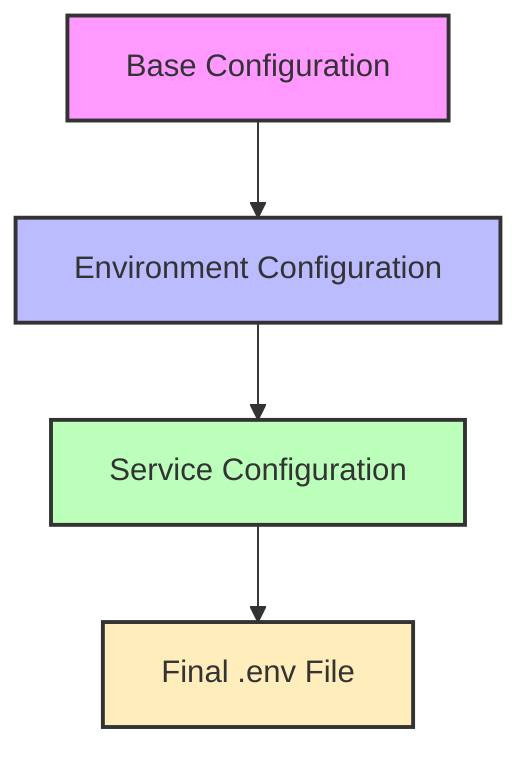
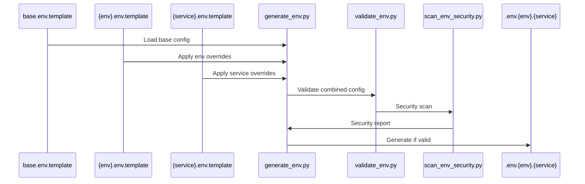

# InvestByYourself - Unified Environment Configuration Management

**Tech-026: Unified Environment Configuration Management**

This directory contains the unified environment configuration system for InvestByYourself, designed to provide centralized, secure, and maintainable configuration management across all services and environments.

## 🎯 Overview

The unified configuration system addresses the following challenges:
- **Scattered Configuration**: Multiple `.env` files across different services
- **Security Issues**: Hardcoded secrets and project IDs in templates
- **Inconsistency**: Different naming conventions and structures
- **Maintenance**: Difficult to manage and update configurations
- **Validation**: No automated validation of configuration files

## 📁 Directory Structure

```
config/
├── environments/           # Environment-specific configurations
│   ├── base.env.template          # Base configuration for all environments
│   ├── development.env.template   # Development environment overrides
│   ├── staging.env.template       # Staging environment overrides
│   └── production.env.template    # Production environment overrides
├── services/              # Service-specific configurations
│   ├── backend.env.template       # Backend service configuration
│   ├── frontend.env.template      # Frontend service configuration
│   └── etl.env.template          # ETL service configuration
├── scripts/               # Configuration management scripts
│   ├── generate_env.py           # Generate environment files from templates
│   ├── validate_env.py           # Validate configuration files
│   └── migrate_env.py            # Migrate from old configuration system
├── backups/               # Backup of old configuration files
└── README.md             # This documentation
```

## 🚀 Quick Start

### 1. Generate Configuration Files

Generate configuration for a specific environment and service:

```bash
# Generate development backend configuration
python config/scripts/generate_env.py --environment development --service backend

# Generate production frontend configuration
python config/scripts/generate_env.py --environment production --service frontend

# Generate all services for development environment
python config/scripts/generate_env.py --environment development --all-services
```

### 2. Validate Configuration Files

Validate your configuration files for security and consistency:

```bash
# Validate all configurations
python config/scripts/validate_env.py --all

# Validate specific environment
python config/scripts/validate_env.py --environment development

# Validate specific file
python config/scripts/validate_env.py --file .env.development.backend
```

### 3. Migrate from Old System

If you're migrating from the old configuration system:

```bash
# Backup existing configurations
python config/scripts/migrate_env.py --backup

# Migrate to new system
python config/scripts/migrate_env.py --migrate --environment development

# Clean up old files (after validation)
python config/scripts/migrate_env.py --cleanup
```

## 📋 Configuration System Architecture

### 1. Configuration Hierarchy

The configuration system uses a layered inheritance model where each level can override values from previous levels:



1. **Base Configuration** (`base.env.template`)
   - Common variables across all environments
   - Default values and placeholders
   - Documentation and examples
   - Core service settings
   - API configurations
   - Database defaults

2. **Environment Overrides** (`{environment}.env.template`)
   - Environment-specific values
   - Security settings
   - Performance tuning
   - Resource limits
   - Debug settings
   - Logging levels

3. **Service Overrides** (`{service}.env.template`)
   - Service-specific configurations
   - Port numbers and timeouts
   - Feature flags
   - Service dependencies
   - Resource allocations
   - API endpoints

### 2. Variable Resolution

The system uses shell-style variable substitution with defaults:

```bash
# Simple inheritance
API_URL=${API_URL}

# Inheritance with default
DEBUG=${DEBUG:-false}

# Conditional default with prefix
DB_PASSWORD=${DB_PASSWORD:-${ENV_PREFIX:-dev}_db_$(date +%Y%m%d)}

# Required variable (fails if not set)
JWT_SECRET=${JWT_SECRET:?Required for production}
```

#### Resolution Order:
1. Explicit environment variable
2. Inherited from previous layer
3. Default value if provided
4. Fail or placeholder based on environment

### 3. Template Structure

Each template follows a standardized structure:

```bash
#==============================================================================
# Service: ETL
# Environment: Development
# Last Updated: 2024-03-21
#==============================================================================

#------------------------------------------------------------------------------
# Core Settings
#------------------------------------------------------------------------------
SERVICE_NAME=etl
ENVIRONMENT=${ENVIRONMENT:-development}
DEBUG=${DEBUG:-true}

#------------------------------------------------------------------------------
# Database Configuration
#------------------------------------------------------------------------------
DB_HOST=${DB_HOST:-localhost}
DB_PORT=${DB_PORT:-5432}
...
```

### 4. Configuration Categories

#### Core Settings
- `ENVIRONMENT`: Runtime environment
- `DEBUG`: Debug mode toggle
- `LOG_LEVEL`: Logging verbosity
- `SERVICE_NAME`: Service identifier

#### Security Settings
- `JWT_SECRET`: Token signing key
- `ENCRYPTION_KEY`: Data encryption
- `API_KEYS`: External service auth
- `CORS_ORIGINS`: Allowed origins

#### Database Settings
- Connection parameters
- Pool configuration
- Credentials
- Backup settings

#### Cache Settings
- Redis configuration
- Cache timeouts
- Compression options
- Key prefixes

#### API Settings
- Endpoints
- Rate limits
- Timeouts
- Retry policies

#### Service-Specific
- ETL intervals
- Queue settings
- Worker counts
- Batch sizes

### 5. Environment Types

#### Development
- Local development settings
- Debug enabled
- Verbose logging
- Mock external services
- Auto-generated secrets

#### Staging
- Production-like environment
- Reduced resource limits
- Test data
- Monitoring enabled
- Separate credentials

#### Production
- Production settings
- Maximum security
- Optimized performance
- Real external services
- Required explicit secrets

### 6. Configuration Flow



### 7. File Organization

```
config/
├── environments/           # Environment templates
│   ├── base.env.template          # Base configuration
│   ├── development.env.template   # Development overrides
│   ├── staging.env.template       # Staging overrides
│   └── production.env.template    # Production overrides
├── services/              # Service templates
│   ├── backend.env.template       # Backend service
│   ├── frontend.env.template      # Frontend service
│   └── etl.env.template          # ETL service
└── scripts/              # Management tools
    ├── generate_env.py           # Config generator
    ├── validate_env.py           # Config validator
    └── scan_env_security.py      # Security scanner
```

## 🔒 Security Features & Best Practices

### 1. Variable Inheritance & Defaults
```bash
# Good: Use variable inheritance with secure defaults
POSTGRES_PASSWORD=${POSTGRES_PASSWORD:-${RANDOM_PREFIX:-dev}_pg_${RANDOM_SUFFIX:-$(date +%Y%m%d%H%M%S)}}

# Bad: Hardcoded default or no default
POSTGRES_PASSWORD=${POSTGRES_PASSWORD}  # No default, fails if not set
POSTGRES_PASSWORD=hardcoded_password    # Insecure hardcoded value
```

### 2. Secure Random Generation
```bash
# Good: Use OpenSSL for cryptographic randomness
ENCRYPTION_KEY=${ENCRYPTION_KEY:-${RANDOM_PREFIX:-dev}_encryption_$(openssl rand -hex 16)}

# Bad: Predictable patterns
ENCRYPTION_KEY=${ENCRYPTION_KEY:-dev_key_2025}
```

### 3. Environment-Specific Security
```bash
# Development: Allow secure defaults with random generation
SUPABASE_ANON_KEY=${SUPABASE_ANON_KEY:-${RANDOM_PREFIX:-dev}_supabase_$(date +%Y%m%d%H%M%S)}

# Production: Require explicit values
SUPABASE_ANON_KEY=${SUPABASE_ANON_KEY:?Production requires SUPABASE_ANON_KEY}
```

### 4. Sensitive Data Handling
- **Never commit `.env` files**: Add to `.gitignore`
- **Use environment references**: `${VAR}` instead of values
- **Secure defaults**: Use random generation with timestamps
- **Production values**: Always require explicit setting
- **Backup securely**: Encrypt or exclude from backups
- **Rotate regularly**: Implement key rotation policy

### 5. Security Validation
```bash
# Run security scan before commits
python config/scripts/scan_env_security.py --all

# Validate production configuration
python config/scripts/validate_env.py --environment production

# Check for exposed secrets
ggshield secret scan path .
```

### 6. Access Control
- **Least Privilege**: Minimize access scope
- **Service Isolation**: Separate credentials per service
- **Role-Based Access**: Use service-specific roles
- **Key Rotation**: Regular credential rotation
- **Audit Trail**: Log configuration changes

### 7. Security Tools Integration
```yaml
# Pre-commit hooks for security
- repo: local
  hooks:
    - id: env-security-scan
      name: Environment Security Scan
      entry: python config/scripts/scan_env_security.py --all
      language: python
      files: ^(\.env.*|config/.*\.template)$
      stages: [commit]
```

### 8. Secure Development Workflow
1. **Template Updates**:
   ```bash
   # Update template
   vim config/services/etl.env.template

   # Validate changes
   python config/scripts/validate_env.py --file config/services/etl.env.template

   # Security scan
   python config/scripts/scan_env_security.py --file config/services/etl.env.template
   ```

2. **Environment Generation**:
   ```bash
   # Generate with validation
   python config/scripts/generate_env.py --environment development --service etl

   # Verify security
   python config/scripts/scan_env_security.py --environment development
   ```

3. **Production Deployment**:
   ```bash
   # Validate production config
   python config/scripts/validate_env.py --environment production

   # Security scan
   python config/scripts/scan_env_security.py --environment production

   # Generate with strict mode
   python config/scripts/generate_env.py --environment production --strict
   ```

### 9. Security Monitoring
- **Regular Scans**: Automated security scanning
- **Validation Reports**: Track validation results
- **Compliance Checks**: Meet security standards
- **Incident Response**: Plan for security issues
- **Documentation**: Keep security docs updated

## 🛠️ Configuration Categories

### Environment & Application
- `ENVIRONMENT`: Current environment (development, staging, production)
- `DEBUG`: Debug mode flag
- `LOG_LEVEL`: Logging level (DEBUG, INFO, WARNING, ERROR)

### Database Configuration
- `POSTGRES_HOST`, `POSTGRES_PORT`, `POSTGRES_DATABASE`
- `POSTGRES_USER`, `POSTGRES_PASSWORD`
- Connection pool settings

### Cache & Storage
- `REDIS_HOST`, `REDIS_PORT`, `REDIS_PASSWORD`
- `MINIO_HOST`, `MINIO_PORT`, `MINIO_ACCESS_KEY`, `MINIO_SECRET_KEY`

### External APIs
- `FRED_API_KEY`: Federal Reserve Economic Data API
- `ALPHA_VANTAGE_API_KEY`: Alpha Vantage API
- `FMP_API_KEY`: Financial Modeling Prep API

### Supabase Configuration
- `SUPABASE_URL`: Supabase project URL
- `SUPABASE_ANON_KEY`: Public anonymous key
- `SUPABASE_SERVICE_ROLE_KEY`: Service role key

### Security Configuration
- `ENCRYPTION_KEY`: Data encryption key
- `JWT_SECRET`: JWT signing secret
- `CORS_ORIGINS`: Allowed CORS origins

## 📝 Usage Examples

### Development Environment

```bash
# Generate development configuration for all services
python config/scripts/generate_env.py --environment development --all-services

# This creates:
# - .env.development.backend
# - .env.development.frontend
# - .env.development.etl
```

### Production Environment

```bash
# Generate production backend configuration
python config/scripts/generate_env.py --environment production --service backend

# Validate production configuration
python config/scripts/validate_env.py --environment production
```

### Custom Output Location

```bash
# Generate to custom location
python config/scripts/generate_env.py --environment development --service backend --output /path/to/custom.env
```

## 🔍 Validation Features

The validation system checks for:

### Security Issues
- Hardcoded secrets in templates
- Weak passwords
- Insecure default values
- Placeholder values in production

### Consistency Issues
- Missing required variables
- Inconsistent values across environments
- Invalid variable formats

### Format Issues
- Invalid numeric values
- Invalid boolean values
- Invalid URL formats
- Missing quotes around values with spaces

## 🚨 Common Issues and Solutions

### Issue: "Placeholder value detected"
**Solution**: Replace placeholder values with actual values:
```bash
# Instead of:
SUPABASE_URL=https://your-project-id.supabase.co

# Use:
SUPABASE_URL=https://ztxlcatckspsdtkepmwy.supabase.co
```

### Issue: "Weak password detected"
**Solution**: Use strong passwords with 16+ characters, mixed case, numbers, and symbols:
```bash
# Instead of:
POSTGRES_PASSWORD=password

# Use:
POSTGRES_PASSWORD=Str0ng!P@ssw0rd2025
```

### Issue: "Required variable missing"
**Solution**: Add the missing variable to your configuration:
```bash
# Add missing variable:
FRED_API_KEY=your_actual_fred_api_key
```

## 🔄 Migration from Old System

If you're migrating from the old configuration system:

### 1. Backup Existing Files
```bash
python config/scripts/migrate_env.py --backup
```

### 2. Review Backup
Check `config/backups/` for your backed up files.

### 3. Migrate Configurations
```bash
python config/scripts/migrate_env.py --migrate --environment development
```

### 4. Generate New Files
```bash
python config/scripts/generate_env.py --environment development --all-services
```

### 5. Validate New System
```bash
python config/scripts/validate_env.py --all
```

### 6. Update Deployment Scripts
Update your deployment scripts to use the new configuration files.

### 7. Clean Up Old Files
```bash
python config/scripts/migrate_env.py --cleanup
```

## 📚 Script Documentation

### `generate_env.py`
Generates environment configuration files from templates.

**Options:**
- `--environment`: Target environment (development, staging, production)
- `--service`: Target service (backend, frontend, etl)
- `--all-services`: Generate for all services
- `--output`: Custom output file path

### `validate_env.py`
Validates environment configuration files.

**Options:**
- `--file`: Validate specific file
- `--environment`: Validate all files for environment
- `--all`: Validate all configurations
- `--output-format`: Output format (text, json)

### `migrate_env.py`
Migrates from old configuration system.

**Options:**
- `--backup`: Backup existing configurations
- `--migrate`: Migrate to new system
- `--environment`: Target environment for migration
- `--cleanup`: Clean up old files
- `--validate`: Validate migration
- `--guide`: Show migration guide

## 🎯 Best Practices

### 1. Use Environment Variables
Always use environment variables for sensitive data:
```bash
# Good
POSTGRES_PASSWORD=${POSTGRES_PASSWORD}

# Bad
POSTGRES_PASSWORD=hardcoded_password
```

### 2. Validate Before Deployment
Always validate configurations before deployment:
```bash
python config/scripts/validate_env.py --environment production
```

### 3. Use Strong Passwords
Use strong, unique passwords for all services:
```bash
# Good: 16+ characters, mixed case, numbers, symbols
POSTGRES_PASSWORD=Str0ng!P@ssw0rd2025

# Bad: Weak password
POSTGRES_PASSWORD=password
```

### 4. Keep Templates Updated
Update templates when adding new configuration options:
```bash
# Add new variable to appropriate template
echo "NEW_FEATURE_ENABLED=true" >> config/environments/base.env.template
```

### 5. Document Changes
Document configuration changes in commit messages and documentation.

## 🔧 Troubleshooting

### Script Not Found
```bash
# Make sure you're in the project root
cd /path/to/InvestByYourself

# Run scripts with full path
python config/scripts/generate_env.py --help
```

### Permission Denied
```bash
# Make scripts executable (Linux/Mac)
chmod +x config/scripts/*.py
```

### Import Errors
```bash
# Install required dependencies
pip install -r requirements.txt
```

## 📞 Support

For issues with the configuration system:

1. Check the validation output for specific errors
2. Review the backup files in `config/backups/`
3. Consult this documentation
4. Check the migration guide: `python config/scripts/migrate_env.py --guide`

## 🔄 Version History

- **v1.0.0**: Initial unified configuration system
- **Tech-026**: Complete rewrite with security improvements and automation

---

**Note**: This configuration system is part of Tech-026: Unified Environment Configuration Management. For more information, see the [MASTER_TODO.md](../MASTER_TODO.md) file.
