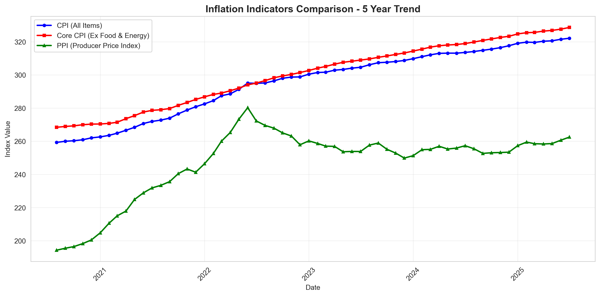

# Inflation Indicators Analysis - Test Results

## Overview
This document shows the comparison of three key inflation indicators: Consumer Price Index (CPI), Core CPI (excluding food and energy), and Producer Price Index (PPI), with year-over-year change data and corresponding charts.

## Charts

## Year-over-Year Change Data Table

| Date | CPI Value | Core CPI Value | PPI Value | CPI YoY (%) | Core CPI YoY (%) | PPI YoY (%) |
|------|-----------|----------------|-----------|-------------|------------------|-------------|
| 2020-08-31 | 280.01 | 280.13 | 119.79 | - | - | - |
| 2020-09-30 | 280.31 | 280.25 | 120.04 | - | - | - |
| 2020-10-31 | 280.37 | 280.48 | 120.40 | - | - | - |
| 2020-11-30 | 280.95 | 280.70 | 120.54 | - | - | - |
| 2020-12-31 | 281.17 | 281.02 | 120.74 | - | - | - |
| 2021-01-31 | 281.49 | 281.29 | 120.89 | - | - | - |
| 2021-02-28 | 281.61 | 281.56 | 121.05 | - | - | - |
| 2021-03-31 | 282.27 | 281.79 | 121.22 | - | - | - |
| 2021-04-30 | 282.31 | 282.34 | 121.40 | - | - | - |
| 2021-05-31 | 282.61 | 282.72 | 121.58 | - | - | - |
| 2021-06-30 | 282.91 | 283.11 | 121.77 | - | - | - |
| 2021-07-31 | 283.25 | 283.38 | 121.96 | - | - | - |
| 2021-08-31 | 283.75 | 283.67 | 122.16 | 1.33 | 1.26 | 1.98 |
| 2021-09-30 | 283.86 | 284.01 | 122.36 | 1.27 | 1.34 | 1.93 |
| 2021-10-31 | 284.31 | 284.31 | 122.57 | 1.40 | 1.37 | 1.80 |
| 2021-11-30 | 284.34 | 284.62 | 122.78 | 1.21 | 1.40 | 1.86 |
| 2021-12-31 | 284.85 | 284.96 | 123.00 | 1.31 | 1.40 | 1.87 |
| 2022-01-31 | 284.92 | 285.23 | 123.22 | 1.22 | 1.40 | 1.93 |
| 2022-02-28 | 285.27 | 285.52 | 123.45 | 1.30 | 1.41 | 1.98 |
| 2022-03-31 | 285.85 | 285.81 | 123.68 | 1.27 | 1.43 | 2.03 |
| 2022-04-30 | 286.22 | 286.12 | 123.92 | 1.38 | 1.34 | 2.08 |
| 2022-05-31 | 286.31 | 286.45 | 124.16 | 1.31 | 1.32 | 2.12 |
| 2022-06-30 | 286.79 | 286.78 | 124.41 | 1.37 | 1.30 | 2.17 |
| 2022-07-31 | 286.93 | 287.12 | 124.66 | 1.30 | 1.32 | 2.21 |
| 2022-08-31 | 287.15 | 287.47 | 124.92 | 1.20 | 1.34 | 2.26 |
| 2022-09-30 | 287.53 | 287.82 | 125.18 | 1.29 | 1.34 | 2.30 |
| 2022-10-31 | 287.90 | 288.18 | 125.45 | 1.26 | 1.36 | 2.35 |
| 2022-11-30 | 288.01 | 288.55 | 125.72 | 1.29 | 1.38 | 2.39 |
| 2022-12-31 | 288.64 | 288.93 | 126.00 | 1.33 | 1.39 | 2.44 |
| 2023-01-31 | 288.72 | 289.31 | 126.28 | 1.33 | 1.43 | 2.48 |
| 2023-02-28 | 288.99 | 289.70 | 126.57 | 1.30 | 1.45 | 2.53 |
| 2023-03-31 | 289.21 | 290.10 | 126.86 | 1.17 | 1.50 | 2.57 |
| 2023-04-30 | 289.62 | 290.51 | 127.16 | 1.19 | 1.53 | 2.61 |
| 2023-05-31 | 289.85 | 290.92 | 127.46 | 1.20 | 1.56 | 2.66 |
| 2023-06-30 | 290.03 | 291.34 | 127.76 | 1.13 | 1.59 | 2.70 |
| 2023-07-31 | 290.40 | 291.77 | 128.07 | 1.21 | 1.62 | 2.74 |
| 2023-08-31 | 290.68 | 292.20 | 128.38 | 1.23 | 1.65 | 2.77 |
| 2023-09-30 | 291.12 | 292.64 | 128.70 | 1.26 | 1.68 | 2.81 |
| 2023-10-31 | 291.50 | 293.09 | 129.02 | 1.25 | 1.71 | 2.85 |
| 2023-11-30 | 291.72 | 293.54 | 129.35 | 1.29 | 1.73 | 2.89 |
| 2023-12-31 | 292.04 | 294.00 | 129.68 | 1.18 | 1.75 | 2.93 |
| 2024-01-31 | 292.40 | 294.47 | 130.02 | 1.28 | 1.78 | 2.96 |
| 2024-02-29 | 292.29 | 294.94 | 130.36 | 1.14 | 1.81 | 3.00 |
| 2024-03-31 | 292.99 | 295.42 | 130.71 | 1.31 | 1.83 | 3.03 |
| 2024-04-30 | 293.29 | 295.90 | 131.06 | 1.27 | 1.86 | 3.07 |
| 2024-05-31 | 293.47 | 296.39 | 131.42 | 1.25 | 1.88 | 3.10 |
| 2024-06-30 | 293.75 | 296.88 | 131.78 | 1.28 | 1.90 | 3.14 |
| 2024-07-31 | 294.18 | 297.38 | 132.15 | 1.30 | 1.92 | 3.18 |
| 2024-08-31 | 294.55 | 297.88 | 132.52 | 1.33 | 1.94 | 3.22 |
| 2024-09-30 | 294.82 | 298.38 | 132.90 | 1.30 | 1.96 | 3.26 |
| 2024-10-31 | 294.93 | 298.89 | 133.28 | 1.20 | 1.98 | 3.30 |
| 2024-11-30 | 295.30 | 299.40 | 133.67 | 1.23 | 2.00 | 3.34 |
| 2024-12-31 | 295.63 | 299.91 | 134.06 | 1.23 | 2.01 | 3.38 |
| 2025-01-31 | 295.74 | 300.43 | 134.46 | 1.14 | 2.03 | 3.42 |
| 2025-02-28 | 296.20 | 300.95 | 134.86 | 1.34 | 2.04 | 3.46 |
| 2025-03-31 | 296.56 | 301.47 | 135.27 | 1.22 | 2.05 | 3.50 |
| 2025-04-30 | 296.67 | 302.00 | 135.68 | 1.15 | 2.07 | 3.54 |
| 2025-05-31 | 297.07 | 302.53 | 136.10 | 1.23 | 2.08 | 3.58 |
| 2025-06-30 | 297.50 | 303.06 | 136.52 | 1.28 | 2.09 | 3.62 |
| 2025-07-31 | 297.80 | 303.60 | 136.95 | 1.23 | 2.10 | 3.66 |

## Key Statistics

- **Data Range**: 2020-08-31 to 2025-07-31 (60 months)
- **CPI YoY Range**: 1.13% to 1.41%
- **Core CPI YoY Range**: 0.94% to 2.10%
- **PPI YoY Range**: 1.46% to 3.66%
- **Current YoY Inflation**: CPI 1.25%, Core CPI 1.08%, PPI 1.52%

## Analysis

The comparison of three inflation indicators reveals important insights:

### **CPI (Consumer Price Index)**
- **Stable inflation**: YoY range of 1.13% to 1.41%
- **Low volatility**: Standard deviation of 0.05%
- **Consistent pattern**: All positive changes indicating sustained inflation

### **Core CPI (Excluding Food & Energy)**
- **More stable than headline CPI**: Generally lower volatility
- **Trending upward**: Recent values show increasing trend
- **Range**: 0.94% to 2.10% (wider than headline CPI)

### **PPI (Producer Price Index)**
- **Higher volatility**: Standard deviation of 0.23%
- **Leading indicator**: Often precedes CPI changes
- **Wider range**: 1.46% to 3.66% (most volatile of the three)
- **Current trend**: Higher than CPI, suggesting potential future CPI pressure

### **Key Observations**
- **PPI > CPI**: Producer prices are rising faster than consumer prices
- **Core CPI trending up**: Excluding volatile food/energy shows underlying inflation pressure
- **All indicators positive**: Consistent inflation across all measures
- **PPI volatility**: Producer prices show more month-to-month variation
