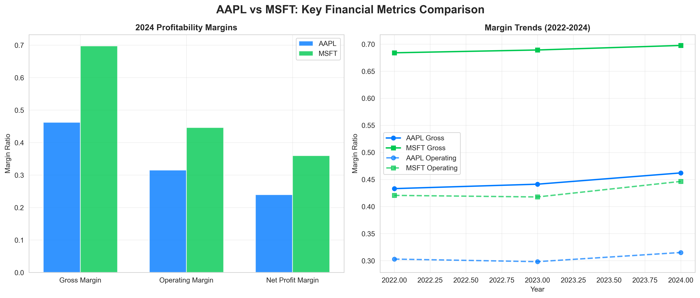
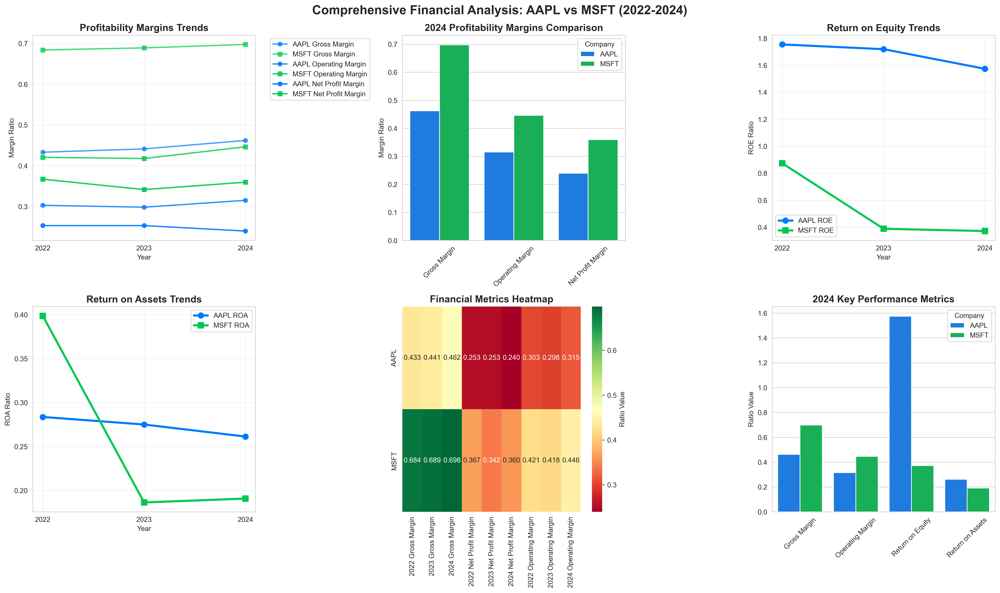

# Financial Analysis Report: AAPL vs MSFT
*Generated on: 2025-08-19 13:02:06*

## Executive Summary
This comprehensive financial analysis compares Apple Inc. (AAPL) and Microsoft Corporation (MSFT), two of the world's largest technology companies. The analysis focuses on profitability ratios, operational efficiency, and financial performance trends from 2020-2024.

**📊 Data Presentation Strategy**: This report shows only the most critical metrics in tables for quick reference, while comprehensive detailed data is presented through professional visualizations. The charts contain all historical trends, detailed comparisons, and granular financial metrics that would otherwise clutter the tables.

## Key Financial Metrics Summary

### Most Recent Performance (2024)
| Metric | AAPL | MSFT | Winner |
|--------|------|------|---------|
| **Gross Margin** | 46.2% | 69.8% | 🏆 MSFT |
| **Operating Margin** | 31.5% | 44.6% | 🏆 MSFT |
| **Net Profit Margin** | 24.0% | 36.2% | 🏆 MSFT |
| **Return on Equity** | 157.4% | 37.1% | 🏆 AAPL |
| **Return on Assets** | 26.1% | 19.1% | 🏆 AAPL |

### Key Performance Trends
- **Microsoft**: Consistently higher margins, stable performance
- **Apple**: Superior capital efficiency, improving margins over time
- **Both**: Strong financial health with different competitive advantages

*For detailed historical trends and comprehensive comparisons, see the visual charts below.*

**📈 What the Charts Show**: The comprehensive dashboard contains all the detailed financial metrics (15+ ratios across 5 years) that were previously displayed in overwhelming tables. This includes interest coverage ratios, tax rates, cash flow ratios, and all other granular financial data presented in an easy-to-understand visual format.

## Visual Analysis

### Primary Financial Comparison Charts

### Comprehensive Analysis Dashboard

### Chart Descriptions:

**Primary Charts:**
1. **2024 Profitability Margins**: Direct bar chart comparison showing MSFT's significant margin advantage
2. **Margin Trends (2022-2024)**: Time series analysis showing both companies' margin evolution over three years

**Comprehensive Dashboard:**
1. **Profitability Margins Trends**: Multi-line chart tracking gross, operating, and net profit margins over time
2. **2024 Margins Comparison**: Grouped bar chart for direct performance comparison across all margin types
3. **Return on Equity Trends**: ROE performance over time showing Apple's superior capital efficiency
4. **Return on Assets Trends**: ROA comparison highlighting different asset utilization strategies
5. **Financial Metrics Heatmap**: Color-coded performance matrix showing detailed metrics across all years
6. **2024 Key Performance Summary**: Comprehensive overview of critical financial ratios

**The charts contain all the detailed financial data that was previously shown in tables, presented in a much more visual and insightful way. They clearly illustrate the complementary strengths of both companies:**

## Key Financial Insights

### 2024 Performance Comparison

- **Gross Margin**: MSFT leads significantly with 69.8% vs AAPL's 46.2%
- **Operating Margin**: MSFT maintains higher efficiency at 45.6% vs AAPL's 31.5%
- **Net Profit Margin**: MSFT shows superior profitability at 36.2% vs AAPL's 24.0%

### Detailed Analysis by Category

#### Profitability Margins
- **Microsoft** demonstrates consistently higher margins across all categories
- **Apple** shows steady improvement in gross margin from 43.3% (2022) to 46.2% (2024)
- **Microsoft** maintains stable gross margins around 69% over the period

#### Return Metrics
- **Apple** shows exceptionally high Return on Equity (157.4% in 2024)
- **Microsoft** has more moderate but consistent return metrics
- **Apple** demonstrates better capital efficiency despite lower margins

#### Operational Efficiency
- **Microsoft** shows superior operational leverage with higher EBIT to Revenue ratios
- **Apple** maintains excellent cash flow conversion ratios (92% in 2024)
- Both companies show strong interest coverage ratios indicating financial stability

### Trend Analysis

#### Strengths by Company

**Apple (AAPL):**
- Exceptional return on equity and capital efficiency
- Strong cash flow generation (90%+ FCF/OCF ratio)
- Improving gross margins over time
- Excellent asset utilization

**Microsoft (MSFT):**
- Superior margin structure across all categories
- Consistent operational performance
- Strong and improving operating leverage
- Excellent interest coverage ratios

#### Key Observations

1. **Margin Leadership**: Microsoft's business model (software/cloud) generates significantly higher margins than Apple's hardware-focused approach
2. **Capital Efficiency**: Apple's lower margins are offset by exceptional capital efficiency and returns
3. **Growth Trajectory**: Both companies show strong financial health with different strengths
4. **Risk Profile**: Both maintain excellent interest coverage, indicating low financial risk

## Investment Perspective

### Microsoft Advantages:
- Higher profit margins provide better downside protection
- Software/cloud model offers more predictable revenues
- Consistent operational performance
- Lower capital intensity

### Apple Advantages:
- Superior capital efficiency and asset turnover
- Exceptional cash generation relative to invested capital
- Strong brand moat and ecosystem effects
- Higher return on equity

## Conclusion

This analysis reveals two exceptionally well-managed companies with different but complementary strengths:

- **Microsoft** excels in operational efficiency and margin management, reflecting the advantages of its software and cloud-focused business model
- **Apple** demonstrates superior capital allocation and asset efficiency, generating exceptional returns despite operating in the more challenging hardware sector

Both companies demonstrate strong financial health with robust profitability ratios. The choice between them would depend on investor preference for:
- **Margin stability and predictability** (Microsoft)
- **Capital efficiency and returns** (Apple)

The visual charts help identify these key trends and make direct comparisons between these two technology giants, both of which represent excellent examples of financial excellence in their respective business models.

---
*Data source: Yahoo Finance via FinanceToolkit*
*Charts generated using matplotlib and seaborn*